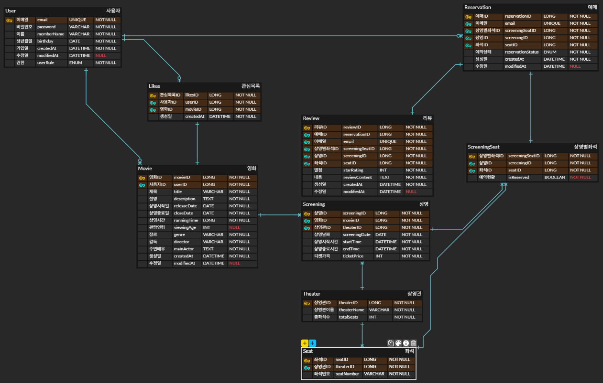

# 산업수학 2 프로젝트

산업수학 2 수업은 함께 프로젝트를 만들어가는 것을 목표로 합니다.

## 평가

- 참여
- 프로젝트 이해
- 코드 이해

## 준비 작업

1. 프로그램 설치

   - [Node.js(LTS)](https://nodejs.org/ko/download/)
   - [VS Code](https://code.visualstudio.com/download)
   - [Git](https://git-scm.com/downloads) - 분산 버전 관리 시스템

2. [https://compmath.korea.ac.kr/gitlab](https://compmath.korea.ac.kr/gitlab) 수강생 등록

3. 깃 클론

   ```bash
   git clone https://compmath.korea.ac.kr/gitlab/courses1/indust-math/2025-2/2025-industmath-2.git
   ```

4. 피그마 등록

## 기술 세부 사항

### 프론트엔드

- Vite(Bundler)
- React.js(Frontend Framework)
- Typescript(Type)
- Tailwindcss(Style)
- Wouter(Router)

### 백엔드

- Node.js(LTS v22)
- Express.js(Backend)
- PostgreSQL(v17): Database

## 프로젝트 주제(예시)

- 챗팅: 인증, 메시지 송수신 : 1
- 카페(커뮤니티): 에브리타임: 2
- 객실/영화 예약, 예매 : 4

  - CGV, 메가박스 홈페이지
  - 고객: 영화 조회(상영중, 예정), 댓글, 별점, 비회원/회원 인증
  - 상영시간, 상영관
  - 예매: 좌석, 내역, 결제(화면만), 시작 시간 몇 분 전에 못하게
  - 관리자: 영화 정보 등록/삭제/수정

- 키오스크: 카페, 음식점
- 블로그: 사진 업로드, 사용자 인증, 글 분류

## 계획

- 피그마 이용 UI 작성
- 프론트엔드 구현(타입스크립드, 리액트)
- 백엔드 구현

## 프로젝트 실행

## 프론트엔드

프로젝트를 복제한 후 처음 실행할 때는 다음과 같은 명령어를 실행해서 필요한 패키지들을 설치하셔야 합니다. 프로젝트 복제한 후 최초 한 번만 필요합니다.

```bash
cd frontend
```

```bash
npm install
```

```bash
npm run dev
```

## 백엔드

프로젝트를 복제(clone)한 후 처음 실행할 때는 다음과 같은 명령어를 실행해서 필요한 패키지들을 설치하셔야 합니다.

**backend** 폴더로 이동

```bash
cd backend
```

**새로 설치한 모듈이 있을 때에 실행**

```bash
npm install
```

**백엔드 서버 실행**

```bash
npm run dev
```

### Database 설정

1. [PostgreSQL 내려받기](https://www.postgresql.org/download/) 및 설치

   - 프로그램 설치할 때 `postgres` 계정의 비밀번호를 설정했으면 잘 기억해야 합니다. 그 비밀번호를 계속 사용해야 합니다. 비밀번호를 설정하지 않았으면 상관없습니다.

1. 아래 명령어들은 터미널에서 실행합니다.

1. 다음을 실행하여 `postgres` user로 로그인합니다.

   ```bash
   $ psql -U postgres
   ```

1. 다음을 실행하여 `test` user 생성하고 비밀번호는 `'test'`로 설정합니다.

   ```bash
   postgres=# create user test password 'test';
   ```

1. 다음을 실행하여 `movie_reservation` 데이터베이스 생성합니다.

   ```bash
   postgres=# create database movie_reservation owner test;
   ```

1. 다음을 실행하여 `psql`을 종료합니다.

   ```bash
   postgres=# exit
   ```

1. 백엔드 서버를 다시 실행합니다.

## 설계

### api 명세서

https://www.notion.so/2682843a6e8a808597fae82f9410fa00?v=2682843a6e8a80478529000c6a996a24&source=copy_link


### erd 설계

https://www.erdcloud.com/d/7JWz4DsBy7tMmBxj8


