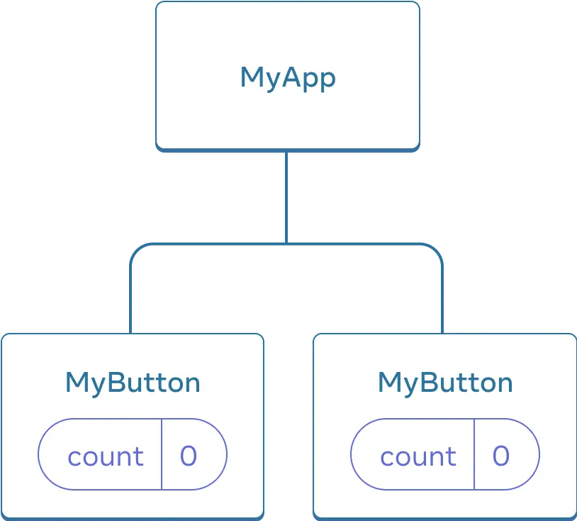
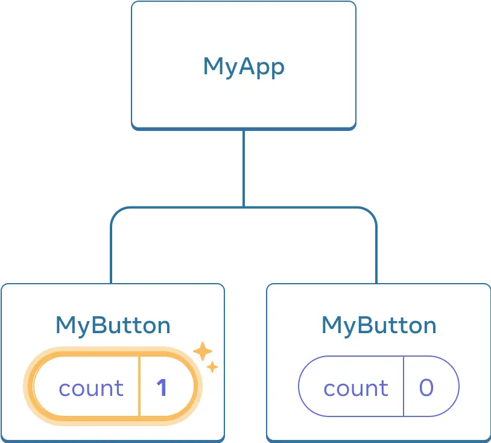
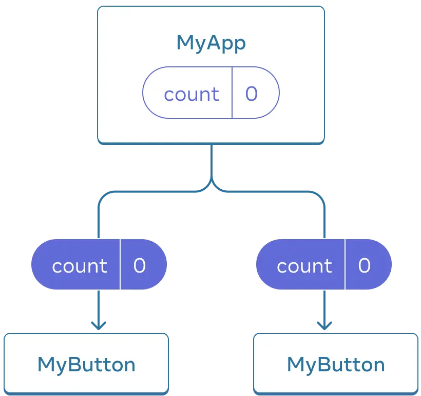
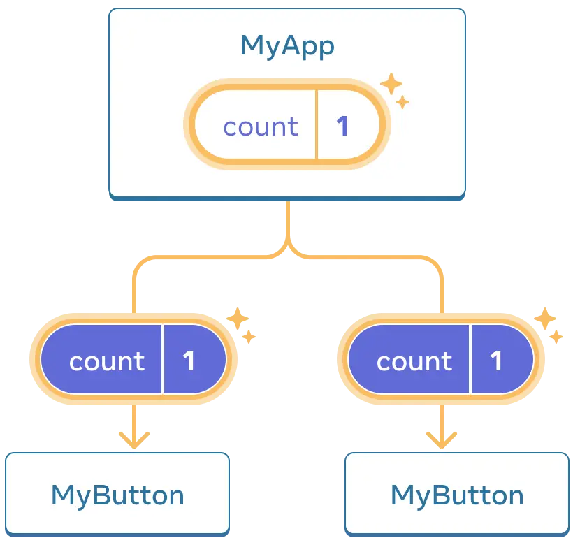

# React.js

[리액트][react-dev-ko]는 JSX를 이용하여 리액트 컴포넌트(component)를 만들고 이것을 이용하여 웹 페이지를 만드는 라이브러리입니다.

## JSX

자바스크립트와 XML(HTML)을 함께 사용할 수 있는 마크업입니다.

```jsx
function AboutPage() {
  return (
    <>
      <h1>About</h1>
      <p>
        Hello there.
        <br />
        How do you do?
      </p>
    </>
  );
}
```
##componenet 
always first word is Big word
리턴시 태그


- 리액트가 jsx 구문을 해석하여 자바스크립트 구문으로 변경
- JSX는 HTML보다 엄격합니다. JSX에서는 `<br />`같이 태그를 닫아야 합니다.
- 컴포넌트는 여러 개의 JSX 태그를 반환할 수 없습니다. `<div>...</div>` 또는 빈 `<>...</>` 래퍼와 같이 공유되는 부모로 감싸야 합니다.

## 컴포넌트(Component)

React 컴포넌트는 마크업을 반환하는 자바스크립트 함수입니다.

```jsx
function MyButton() {
  return <button>I'm a button</button>;
}
```

- 자바스크립트 함수
- 함수이름의 첫 글자를 대문자 사용
- 함수를 호출할 때는 HTML 태그처럼 호출
- 함수의 인수는 HTML 태그의 속성처럼 지정

이제 MyButton을 선언했으므로 다른 컴포넌트 안에 중첩할 수 있습니다.

```jsx
export default function MyApp() {
  return (
    <div>
      <h1>Welcome to my app</h1>
      <MyButton />
    </div>
  );
}
```

## 데이터 표시하기

JSX를 사용하면 자바스크립트에 마크업을 넣을 수 있습니다. **중괄호**를 사용하면 코드에서 일부 변수를 삽입하여 사용자에게 표시할 수 있도록 자바스크립트 식을 사용할 수 있습니다. 아래의 예시는 user.name을 표시합니다.

```jsx
return <h1>{user.name}</h1>;
```

JSX 중괄호 안에 문자열 연결과 같이 더 복잡한 표현식을 넣을 수도 있습니다.

```jsx
const user = {
  name: 'Hedy Lamarr',
  imageUrl: 'https://i.imgur.com/yXOvdOSs.jpg',
  imageSize: 90,
};

export default function Profile() {
  return (
    <>
      <h1>{user.name}</h1>
      
    </>
  );
}
```

위의 예시에서 `style={{}}`은 특별한 문법이 아니라 `style={ }` JSX 중괄호 안에 있는 일반 `{}` 객체입니다.

## 조건부 렌더링

React에서 조건문을 작성하는 데에는 특별한 문법이 필요 없습니다. 일반적인 자바스크립트 코드를 작성할 때 사용하는 것과 동일한 방법을 사용합니다. 예를 들어 if 문을 사용하여 조건부로 JSX를 포함할 수 있습니다.

```jsx
let content;
if (isLoggedIn) {
  content = <AdminPanel />;
} else {
  content = <LoginForm />;
}
return <div>{content}</div>;
```

더욱 간결한 코드를 원한다면 조건부 삼항 연산자를 사용할 수 있습니다. 이것은 if 문과 달리 JSX 내부에서 동작합니다.

```jsx
<div>{isLoggedIn ? <AdminPanel /> : <LoginForm />}</div>
```

else 분기가 필요하지 않으면 더 짧은 && 연산자를 사용할 수도 있습니다.

```jsx
<div>{isLoggedIn && <AdminPanel />}</div>
```

이러한 접근 방식은 어트리뷰트를 조건부로 지정할 때도 동작합니다. 이러한 자바스크립트 문법에 익숙하지 않다면 항상 `if...else`를 사용하는 것으로 시작할 수 있습니다.

## 리스트 렌더링하기

컴포넌트 리스트를 렌더링하기 위해서는 `for` 문 및 `map()` 함수와 같은 자바스크립트 기능을 사용합니다.

예를 들어 여러 제품이 있다고 가정하겠습니다.

```jsx
const products = [
  { title: 'Cabbage', id: 1 },
  { title: 'Garlic', id: 2 },
  { title: 'Apple', id: 3 },
];
```

컴포넌트 내에서 `map()` 함수를 사용하여 제품 배열을 `<li>` 항목 배열로 변환합니다.

```jsx
const listItems = products.map((product) => (
  <li key={product.id}>{product.title}</li>
));

return <ul>{listItems}</ul>;
```

`<li>`에 key 어트리뷰트가 있는 것을 주목하세요. 목록의 각 항목에 대해, 형제 항목 사이에서 해당 항목을 고유하게 식별하는 문자열 또는 숫자를 전달해야 합니다. React는 나중에 항목을 삽입, 삭제 또는 재정렬할 때 어떤 일이 일어났는지 알기 위해 key를 사용합니다.

```jsx
const products = [
  { title: 'Cabbage', isFruit: false, id: 1 },
  { title: 'Garlic', isFruit: false, id: 2 },
  { title: 'Apple', isFruit: true, id: 3 },
];

export default function ShoppingList() {
  const listItems = products.map((product) => (
    <li
      key={product.id}
      style={{
        color: product.isFruit ? 'magenta' : 'darkgreen',
      }}
    >
      {product.title}
    </li>
  ));

  return <ul>{listItems}</ul>;
}
```

## 이벤트에 응답하기

컴포넌트 내부에 이벤트 핸들러 함수를 선언하여 이벤트에 응답할 수 있습니다.

```jsx
function MyButton() {
  function handleClick() {
    alert('You clicked me!');
  }

  return <button onClick={handleClick}>Click me</button>;
}
```

`onClick={handleClick}`의 끝에 소괄호`( () )`가 없는 것을 주목하세요! 이벤트 핸들러 함수를 호출하지 않고 전달만 하면 됩니다. React는 사용자가 버튼을 클릭할 때 이벤트 핸들러를 호출합니다.

## 화면 업데이트하기

컴포넌트가 특정 정보를 “기억”하여 표시하기를 원하는 경우가 종종 있습니다. 예를 들어 버튼이 클릭된 횟수를 세고 싶을 수 있습니다. 이렇게 하려면 컴포넌트에 State를 추가하면 됩니다.

먼저, React에서 [`useState`](https://ko.react.dev/reference/react/useState)를 가져옵니다.

```jsx
import { useState } from 'react';
```

이제 컴포넌트 내부에 State 변수를 선언할 수 있습니다.

```jsx
function MyButton() {
  const [count, setCount] = useState(0);
  // ...
```

`useState`로부터 현재 State (`count`)와 이를 업데이트할 수 있는 함수 (`setCount`)를 얻을 수 있습니다. 이들을 어떤 이름으로도 지정할 수 있지만 `[something, setSomething]`으로 작성하는 것이 일반적입니다.

버튼이 처음 표시될 때는 `useState()`에 `0`을 전달했기 때문에 `count`가 `0`이 됩니다. State를 변경하고 싶다면 `setCount()`를 실행하고 새 값을 전달하세요. 이 버튼을 클릭하면 카운터가 증가합니다.

```jsx
function MyButton() {
  const [count, setCount] = useState(0);

  function handleClick() {
    setCount(count + 1);
  }

  return <button onClick={handleClick}>Clicked {count} times</button>;
}
```

React가 컴포넌트 함수를 다시 호출합니다. 이번에는 `count`가 `1`이 되고, 그 다음에는 `2`가 될 것입니다. 이런 방식입니다.

같은 컴포넌트를 여러 번 렌더링하면 각각의 컴포넌트는 고유한 State를 얻게 됩니다. 각 버튼을 개별적으로 클릭해 보세요.

```jsx
import { useState } from 'react';

export default function MyApp() {
  return (
    <div>
      <h1>Counters that update separately</h1>
      <MyButton />
      <MyButton />
    </div>
  );
}

function MyButton() {
  const [count, setCount] = useState(0);

  function handleClick() {
    setCount(count + 1);
  }

  return <button onClick={handleClick}>Clicked {count} times</button>;
}
```

각 버튼이 고유한 count State를 “기억”하고 다른 버튼에 영향을 주지 않는 방식에 주목해 주세요.

## Hook 사용하기

`use`로 시작하는 함수를 Hook이라고 합니다. `useState`는 React에서 제공하는 내장 Hook입니다. 다른 내장 Hook은 [API 참고서](https://ko.react.dev/reference/react)에서 찾아볼 수 있습니다. 또한 기존의 것들을 조합하여 자신만의 Hook을 작성할 수도 있습니다.

Hook은 다른 함수보다 더 제한적입니다. 컴포넌트(또는 다른 Hook)의 상단에서만 Hook을 호출할 수 있습니다. 조건이나 반복에서 `useState`를 사용하고 싶다면 새 컴포넌트를 추출하여 그곳에 넣으세요.

## 컴포넌트 간에 데이터 공유하기

이전 예시에서는 각각의 MyButton에 독립적인 count가 있었고, 각 버튼을 클릭하면 클릭한 버튼의 count만 변경되었습니다.

<div style="display: flex">
<figure>

<figcaption>처음에 각 MyButton의 count State는 0입니다.</figcaption>
</figure>
<figure>

<figcaption>첫 번째 MyButton이 count를 1로 업데이트합니다.</figcaption>
</figure>
</div>

하지만 데이터를 공유하고 항상 함께 업데이트하기 위한 컴포넌트가 필요한 경우가 많습니다.

두 MyButton 컴포넌트가 동일한 `count`를 표시하고 함께 업데이트하려면, State를 개별 버튼에서 모든 버튼이 포함된 가장 가까운 컴포넌트로 “위쪽”으로 이동해야 합니다.

이 예시에서는 MyApp입니다.

<div style="display: flex">
<figure>

<figcaption>처음에 MyApp의 count State는 0이며 두 자식에게 모두 전달합니다.</figcaption>
</figure>
<figure>

<figcaption>클릭 시 MyApp은 count State를 1로 업데이트하고 두 자식에게 전달합니다.</figcaption>
</figure>
</div>

이제 두 버튼 중 하나를 클릭하면 `MyApp`의 `count`가 변경되어 `MyButton`의 카운트가 모두 변경됩니다. 이를 코드로 표현하는 방법은 다음과 같습니다.

먼저 `MyButton`에서 `MyApp`으로 State를 위로 이동합니다.

```jsx
export default function MyApp() {
  const [count, setCount] = useState(0);

  function handleClick() {
    setCount(count + 1);
  }

  return (
    <div>
      <h1>Counters that update separately</h1>
      <MyButton />
      <MyButton />
    </div>
  );
}

function MyButton() {
  // ... we're moving code from here ...
}
```

그 다음 공유된 클릭 핸들러와 함께 `MyApp`에서 각 `MyButton`으로 State를 전달합니다. 이전에 ``와 같은 기본 제공 태그를 사용했던 것처럼 JSX 중괄호를 사용하여 `MyButton`에 정보를 전달할 수 있습니다.

```jsx
export default function MyApp() {
  const [count, setCount] = useState(0);

  function handleClick() {
    setCount(count + 1);
  }

  return (
    <div>
      <h1>Counters that update together</h1>
      <MyButton count={count} onClick={handleClick} />
      <MyButton count={count} onClick={handleClick} />
    </div>
  );
}
```

이렇게 전달한 정보를 _Props_ 라고 합니다. 이제 `MyApp` 컴포넌트는 `count` State와 `handleClick` 이벤트 핸들러를 포함하며, 이 두 가지를 각 버튼에 _Props_ 로 전달합니다.

마지막으로 부모 컴포넌트에서 전달한 _Props_ 를 읽도록 `MyButton`을 변경합니다.

```jsx
function MyButton({ count, onClick }) {
  return <button onClick={onClick}>Clicked {count} times</button>;
}
```

버튼을 클릭하면 `onClick` 핸들러가 실행됩니다. 각 버튼의 `onClick` Prop는 `MyApp` 내부의 `handleClick` 함수로 설정되었으므로 그 안에 있는 코드가 실행됩니다. 이 코드는 `setCount(count + 1)`를 실행하여 `count` State 변수를 증가시킵니다. 새로운 `count` 값은 각 버튼에 Prop로 전달되므로 모든 버튼에는 새로운 값이 표시됩니다. 이를 “State 끌어올리기”라고 합니다. State를 위로 이동함으로써 컴포넌트 간에 State를 공유하게 됩니다.

```jsx
import { useState } from 'react';

export default function MyApp() {
  const [count, setCount] = useState(0);

  function handleClick() {
    setCount(count + 1);
  }

  return (
    <div>
      <h1>Counters that update together</h1>
      <MyButton count={count} onClick={handleClick} />
      <MyButton count={count} onClick={handleClick} />
    </div>
  );
}

function MyButton({ count, onClick }) {
  return <button onClick={onClick}>Clicked {count} times</button>;
}
```

## [state 내 객체 업데이트](https://ko.react.dev/learn/adding-interactivity#updating-objects-in-state)

State는 객체를 포함하여 모든 종류의 JavaScript 타입을 관리할 수 있습니다. 그러나 React state에 있는 객체와 배열을 직접 변경해서는 안 됩니다. 대신 객체나 배열을 업데이트할 때는 새로운 객체를 생성하거나 기존 객체의 복사본을 만들어서 상태를 업데이트해야 합니다.

## [이벤트 전파](https://ko.react.dev/learn/responding-to-events#event-propagation)

이벤트 핸들러는 해당 컴포넌트가 가진 어떤 자식 컴포넌트의 이벤트를 수신할 수도 있습니다. 이를 이벤트가 트리를 따라 “bubble” 되거나 “전파된다”고 표현합니다. 이때 이벤트는 발생한 지점에서 시작하여 트리를 따라 위로 전달됩니다.

## 타입스크립트

## 참조

- [리액트](https://ko.react.dev/)

[react-dev-ko]: https://ko.react.dev/
